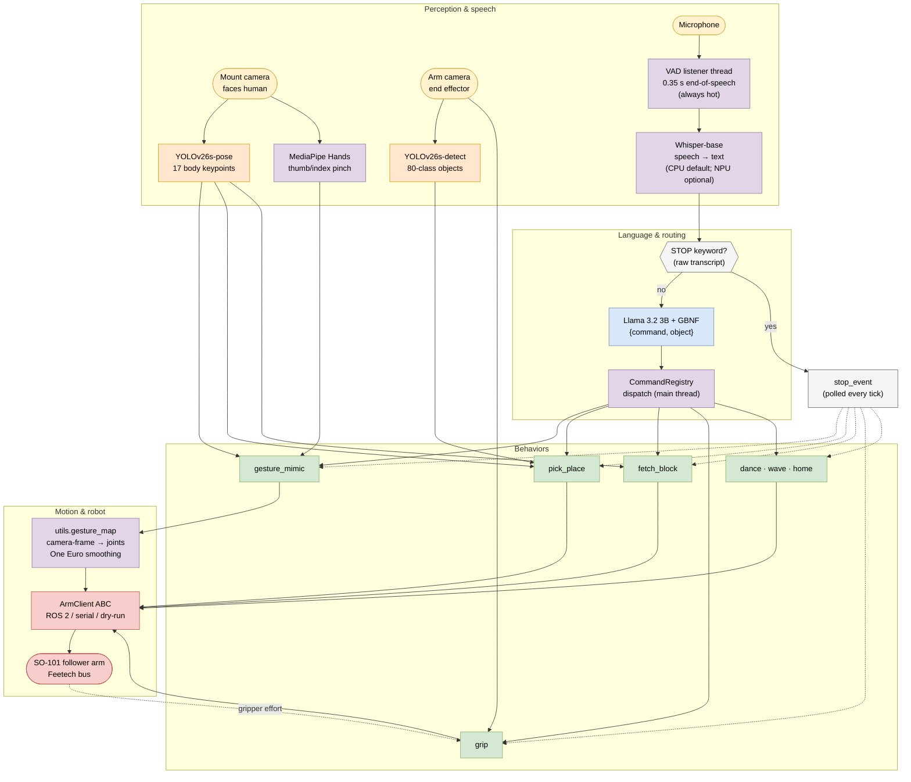
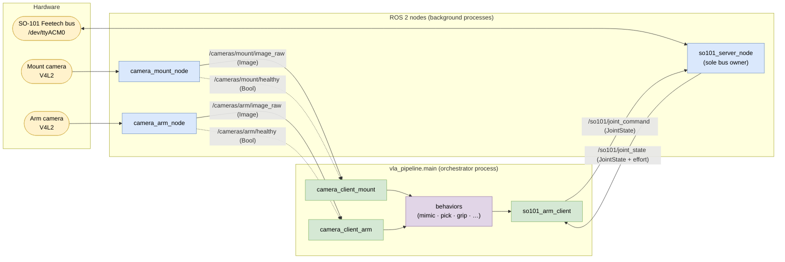

# Strix VVLA Pipeline
Voice-Vision-Language-Action
Whisper-Yolov26-Llama3.2-ROS2

Voice-controlled robot behaviors for the **LeRobot SO-101** arm on an **AMD Ryzen AI APU (Strix Point / Strix Halo, gfx1150 / gfx1151 / gfx1100 for compatibility)** — speech, language, and vision all running locally, split across the NPU, iGPU, and CPU.

The robot has senses: **Whisper is its ears**, **YOLO is its eyes**, **Llama is its brain**, and the **feedback gripper is its sense of touch**. You speak; it hears, understands, looks, and acts.


## Pipeline architecture



Legend — <span title="NPU">🟧 NPU (VitisAI EP)</span> · 🟦 iGPU (ROCm) · 🟪 CPU · 🟩 behavior · 🟥 robot/transport. YOLO-pose and YOLO-detect target the NPU by default; Whisper defaults to CPU because the NPU cannot hold all four ONNX contexts at once. Whisper can instead use its compiled NPU cache when explicitly selected; see [Compute placement → NPU context budget](#npu-context-budget-important).

## The robot's senses → an SO-101

Each model maps to a sense, and each sense maps to a part of the arm it informs.

```mermaid
flowchart LR
    subgraph BODY["SO-101 follower arm"]
        direction TB
        BASE["⬣ Base / shoulder_pan<br/>— aims the whole arm"]
        SHOULDER["● shoulder_lift"]
        ELBOW["● elbow_flex"]
        WRIST["● wrist_flex / wrist_roll"]
        JAW["✦ Gripper jaws"]
        BASE --- SHOULDER --- ELBOW --- WRIST --- JAW
    end

    EARS["👂 EARS<br/><b>Whisper-base · CPU default / NPU optional</b><br/>speech → text"]:::ear
    BRAIN["🧠 BRAIN<br/><b>Llama 3.2 3B · iGPU</b><br/>intent + object<br/>(GBNF-constrained)"]:::brain
    EYES["👁 EYES<br/><b>YOLOv26s · NPU</b><br/>pose = where you are<br/>detect = what to grab"]:::eye
    TOUCH["✋ TOUCH<br/><b>Feedback gripper</b><br/>current + position stall<br/>+ camera verify"]:::touch

    EARS ==>|"what you said"| BRAIN
    BRAIN ==>|"which behavior"| BODY
    EYES ==>|"aim &amp; track<br/>(pan + reach)"| BASE
    EYES ==>|"reach to target<br/>(shoulder/elbow/wrist)"| ELBOW
    TOUCH ==>|"how hard to hold<br/>(stop on contact)"| JAW
    JAW -.->|"effort feedback"| TOUCH

    classDef ear fill:#dae8fc,stroke:#6c8ebf,color:#000,font-size:14px;
    classDef brain fill:#d5e8d4,stroke:#82b366,color:#000,font-size:14px;
    classDef eye fill:#ffe6cc,stroke:#d79b00,color:#000,font-size:14px;
    classDef touch fill:#f8cecc,stroke:#b85450,color:#000,font-size:14px;
```



**Ears (Whisper) → Brain (Llama):** the microphone is gated by an always-hot VAD listener; Whisper turns speech to text on the NPU or CPU, and Llama — constrained by a GBNF grammar so it can only emit `{"command", "object"}` — decides which behavior to run. **Eyes (YOLO) → the arm's aim and reach:** YOLO-pose finds *where you are* (drives `shoulder_pan` and the up/down reach for mimicry and handoff), while YOLO-detect finds *what to grab* (grounds "the ball" and servos the base onto it). **Touch (gripper) → the jaws:** the feedback close loop senses contact through servo current and position stall, confirms with the arm camera, and stops squeezing the instant it has the object — which is why a pen no longer slips.

## Voice commands → behaviors

Llama is constrained by `config/intent.gbnf` so it can only ever emit `{"command": "<intent>", "object": "<words>"}` — no parse failures.

| Say something like | Intent | What happens |
|---|---|---|
| "mirror my arm", "copy my movements" | `gesture_mimic` | YOLO-pose tracks your wrist; a direct camera-frame mapping drives the arm joints to follow your hand (depth from MediaPipe hand size). MediaPipe tracks your thumb–index pinch → gripper. |
| "pick up the ball", "grab the bottle and give it to me" | `pick_place` | YOLO-detect grounds the named object on the arm camera → pan-servo onto it → feedback grasp → find you with YOLO-pose → hand it over. |
| "fetch the block", "bring me the cube" | `fetch_block` | Approach the block at its taught pose → grasp → lift → find you (YOLO-pose) → extend → release → home. |
| "hold this", "take this pencil" | `grip` | Closes until contact (current/stall + grace window), confirms with the arm camera, then **locks the grip**. A following `gesture_mimic` keeps the lock — so the arm can mimic you *while holding a pen to write*. Saying "grip" again releases. |
| "dance", "show me some moves" | `dance` | BPM-paced keyframe choreography. |
| "wave at me", "say hi" | `wave` | Raises the arm and waves `behaviors.wave.cycles` times. |
| "go home", "reset position" | `home` | Returns to the rest pose. |
| "stop", "halt", "freeze" | `stop` | **Keyword-matched on the raw transcript — bypasses the LLM** and interrupts any running behavior immediately. |

## Tested environment

| Component | Version |
|---|---|
| Hardware | AMD Ryzen AI MAX (Strix Halo), iGPU `gfx1100`, XDNA 2 NPU |
| OS | Ubuntu 24.04 |
| ROCm | 7.2.4 |
| Ryzen AI SW | 1.7.1 (VitisAI ONNX Runtime EP) |
| ROS 2 | Jazzy (optional — only for the ROS 2 transport) |
| LeRobot | 0.5.2 (source install, `[feetech]`) |
| PyTorch | 2.11.0+rocm7.13.0 from `repo.amd.com/rocm/whl/gfx1100` |
| Robot | LeRobot SO-101 follower arm |

## Compute placement

| Model | Sense | Device | Runtime |
|---|---|---|---|
| Whisper-base (`amd/whisper-base-onnx-npu`) | ears | **NPU or CPU** (see below) | ONNX Runtime, VitisAI EP |
| Llama 3.2 3B Instruct (Q4_K_M) | brain | **iGPU** | `llama.cpp` `llama-server` (`-DGGML_HIP=ON`) |
| YOLOv26s-pose | eyes (where) | **NPU** | ONNX Runtime, VitisAI EP |
| YOLOv26s-detect | eyes (what) | **NPU** | ONNX Runtime, VitisAI EP |
| MediaPipe Hands | fingers | **CPU** | MediaPipe Tasks |
| Feedback gripper | touch | **bus** | Feetech current/load + camera verify |

Every NPU session is built through one shared factory (`vla_pipeline/utils/npu_session.py`); each `device:` field is set per-model in `config/pipeline.yaml`, and a model set to `npu` falls back to CPU (with a warning) if the VitisAI runtime can't give it a context — so the pipeline never hard-crashes over NPU capacity and also runs (slowly) on a plain dev machine.

### NPU context budget (important)

The XDNA2 NPU partition holds only a **limited number of concurrent hardware contexts** — in practice not enough for *all four* ONNX models (Whisper encoder + decoder count as two) to be resident at once. Whisper-base on the NPU works fine on its own, and the two YOLO models load together fine, but loading all four can exhaust the device with a `HW context creation unsuccessful / sub buffer size and offset` error.

The default split keeps the **latency-sensitive vision** models on the NPU (pose runs at camera rate for mimicry) and runs **Whisper on CPU**, where a short command still transcribes in a few hundred ms — well under the VAD budget. If you'd rather keep Whisper on the NPU, move the YOLO models to CPU instead:

```yaml
# Recommended: vision on NPU, ASR on CPU
whisper:    {device: cpu}
yolo_pose:  {device: npu}
yolo_detect:{device: npu}

# Alternative: ASR on NPU, vision on CPU (mimicry will be laggier)
whisper:    {device: npu}
yolo_pose:  {device: cpu}
yolo_detect:{device: cpu}
```

Because each model falls back to CPU when it can't get a context, you can also just leave them all on `npu` and read the startup logs to see what actually fit, then pin the `device:` fields deliberately.

## ROS 2 nodes & topics

The ROS 2 transport (`robot.use_ros2: true`, `cameras.*.use_ros2: true`) splits the system into background **server nodes** that own the hardware and **client nodes** that live inside the orchestrator process. Only `so101_server_node` ever touches the Feetech bus; everything else talks over topics, so any node can be restarted, replaced, or watched with `ros2 topic echo` independently.



### Nodes

| Node | Process / how it starts | Role | Owns |
|---|---|---|---|
| `camera_mount_node` | `python -m vla_pipeline.vision.camera_node --role mount` (launch/run_pipeline) | Captures the human-facing camera and publishes frames + health | the mount V4L2 device |
| `camera_arm_node` | `python -m vla_pipeline.vision.camera_node --role arm` | Captures the end-effector camera and publishes frames + health | the arm V4L2 device |
| `so101_server_node` | `python -m vla_pipeline.robot.robot_node --server` | **Sole owner of the Feetech bus**; applies joint commands at `control_fps`, streams joint state + gripper effort, parks the arm at rest on shutdown | the SO-101 serial bus |
| `camera_client_mount` | created inside `vla_pipeline.main` (`Ros2Camera`) | Subscribes to the mount image topic, hands the latest frame to behaviors | — |
| `camera_client_arm` | created inside `vla_pipeline.main` (`Ros2Camera`) | Subscribes to the arm image topic for detection / jaw verification | — |
| `so101_arm_client` | created inside `vla_pipeline.main` (`Ros2ArmClient`) | The `ArmClient` implementation behaviors call; publishes commands, reads back joint state + effort | — |

The three client nodes spin on their own background executors inside the single orchestrator process, so from the user's side `python -m vla_pipeline.main` is still one plain program.

### Topics

| Topic | Type | Publisher → Subscriber | Notes |
|---|---|---|---|
| `/cameras/mount/image_raw` | `sensor_msgs/Image` (bgr8) | `camera_mount_node` → `camera_client_mount` | pose / gesture-mimic / person finding |
| `/cameras/mount/healthy` | `std_msgs/Bool` | `camera_mount_node` → (any) | `false` while the device is offline/reopening |
| `/cameras/arm/image_raw` | `sensor_msgs/Image` (bgr8) | `camera_arm_node` → `camera_client_arm` | object detection + grip jaw verification |
| `/cameras/arm/healthy` | `std_msgs/Bool` | `camera_arm_node` → (any) | health flag for the arm camera |
| `/so101/joint_command` | `sensor_msgs/JointState` (deg) | `so101_arm_client` → `so101_server_node` | absolute joint targets; partial dicts allowed |
| `/so101/joint_state` | `sensor_msgs/JointState` | `so101_server_node` → `so101_arm_client` | positions for all joints; **`effort[gripper]` = servo current** (NaN if the bus can't read it) |

All topics use best-effort, keep-last depth-1 QoS — the latest frame/state always wins and vision never backs up behind a slow consumer. Every camera parameter (device, resolution, fps, rotation, topic) is a ROS parameter with defaults from `cameras:` in `config/pipeline.yaml`; point `cameras.arm.device` at the end-effector camera (a `/dev/v4l/by-id/...` path is more stable than an index) and set `rotate` to match its mounting. If a camera is unplugged the node stays up, publishes `healthy: false`, retries every `reopen_interval_s`, and behaviors degrade gracefully (pick-and-place falls back to the mount camera; fetch hands off straight ahead).

Quick inspection:

```bash
ros2 node list                       # camera_mount_node, camera_arm_node, so101_server_node, ...
ros2 topic hz /cameras/arm/image_raw # confirm the arm camera is publishing
ros2 topic echo /so101/joint_state   # watch positions + gripper effort
```

## Repository layout

```
strix-vla-pipeline/
├── bootstrap.sh                  # one-shot setup into a uv venv at ./.venv
├── run_pipeline.sh               # entry point: starts camera + arm nodes, then the orchestrator
├── config/
│   ├── pipeline.yaml             # all tunables (cameras, vad, gesture_mimic, pick_place, grip, …)
│   ├── intent.gbnf               # GBNF grammar: {"command","object"}
│   ├── vaiep_config.json         # VitisAI compiler config for YOLO (BF16, VAIML)
│   └── vitisai_config_whisper_{encoder,decoder}.json
├── launch/
│   └── strix_vla.launch.py       # cameras (mount+arm) + SO-101 server node
├── scripts/
│   ├── compile_npu_models.py     # compile whisper/yolo ONNX for the NPU (SDK venv)
│   ├── export_whisper_onnx.py    # Whisper encoder/decoder ONNX export
│   ├── export_yolo26s_pose.py    # body-keypoint ONNX export
│   ├── export_yolo26s_detect.py  # 80-class detection ONNX export
│   ├── ryzen_ai_env.sh           # LD_LIBRARY_PATH for the VitisAI EP runtime
│   └── install_kernel.sh         # register .venv Jupyter kernel + start llama-server
└── vla_pipeline/
    ├── main.py                   # orchestrator: registry dispatch, listener thread, stop fast path
    ├── audio/
    │   ├── whisper_npu.py        # WhisperONNX + mic capture
    │   └── vad_listener.py       # VAD utterance capture (0.35 s end-of-speech)
    ├── llm/
    │   ├── intents.py            # Intent enum, ParsedCommand, CommandRegistry, system prompt
    │   └── llama_intent.py       # llama-server lifecycle + intent parsing (object slot)
    ├── vision/
    │   ├── camera.py             # CameraClient (direct / ROS 2) per role
    │   ├── camera_node.py        # ROS 2 camera publisher node
    │   ├── yolo_pose_npu.py      # PoseEstimator: letterbox, infer, COCO-17 kpts
    │   ├── yolo_detect_npu.py    # ObjectDetector + spoken-name synonyms
    │   └── mediapipe_hands.py    # HandTracker: normalized thumb–index pinch
    ├── robot/
    │   ├── arm_interface.py      # ArmClient ABC + DirectArm/DryRunArm, get_gripper_load()
    │   ├── robot_node.py         # So101ServerNode (effort in JointState) + Ros2ArmClient
    │   └── test_ros2_arm_motion.py  # ROS 2 per-joint full-range motion test
    ├── behaviors/
    │   ├── gesture_mimic.py      # camera-frame mapping loop, grip-lock aware, --calibrate-depth/-grip
    │   ├── pick_place.py         # voice-grounded pick → hand to person
    │   ├── fetch_block.py        # taught-pose fetch; exports the handoff helpers
    │   ├── grip.py               # feedback close (current/stall/grace) + camera verify
    │   ├── dance.py              # keyframe moves, BPM pacing
    │   └── simple.py             # wave, home
    └── utils/
        ├── config.py             # YAML loader, path resolution
        ├── npu_session.py        # shared VitisAI/CPU ONNX session factory
        ├── gesture_map.py        # direct camera-frame → joint mapping, One Euro smoothing
        └── resource_monitor.py   # CPU/GPU/NPU power, VRAM, DRAM bandwidth
```

## Installation
Install Ubuntu 24.04.4. Install Ryzen AI 1.7.1 once, outside this repository. Unpack the installer into `~/ryzen_ai-1.7.1` and create its virtual environment inside that directory:

```bash
mkdir -p ~/ryzen_ai-1.7.1
cp ~/Downloads/ryzen_ai-1.7.1.tgz ~/ryzen_ai-1.7.1/
cd ~/ryzen_ai-1.7.1
tar -xvzf ryzen_ai-1.7.1.tgz
./install_ryzen_ai.sh -a yes -p $PWD/venv
source /opt/xilinx/xrt/setup.sh
```

`$PWD/venv` is `~/ryzen_ai-1.7.1/venv`. Then clone this repository once. The NPU compile cache is not in git. `./bootstrap.sh` exports the YOLO ONNX files and, when the SDK venv is present, compiles them:

```bash
git clone https://github.com/amd/embedded-x86-ai
export RYZEN_AI_WHEELS=~/ryzen_ai-1.7.1
cd embedded-x86-ai/workshops/vvla-pipeline
./bootstrap.sh
source .venv/bin/activate
source scripts/ryzen_ai_env.sh
```

`./bootstrap.sh` creates `.venv`, downloads Whisper and the Llama GGUF, and exports `models/yolo26s-pose/yolo26s-pose.onnx` and `models/yolo26s/yolo26s.onnx`. It then compiles Whisper, YOLO-pose, and YOLO-detect into `cache/`. Those `.rai` files stay on the machine. Do not clone this repository again inside the workshop, and do not unpack the SDK into the repository.

The NPU compile is the slow part of bootstrap. It runs once per model, and the log scrolls through VAIML tiling output the whole time. On a Ryzen AI APU with Ryzen AI SW 1.7.1, YOLOv26s-pose took about 16 minutes and YOLOv26s-detect about 3 minutes. That run reused an existing Whisper cache, so the two YOLO models took about 20 minutes. Whisper adds its own compile time on a first run. Once `cache/` holds a model's `.rai`, later sessions load it in about a second.

When `cache/` already contains the `.rai` files, skip the export and the compile:

```bash
export RYZEN_AI_WHEELS=~/ryzen_ai-1.7.1
./bootstrap.sh --skip-compile
```

`bootstrap.sh`:

1. apt build deps (ffmpeg, cmake, portaudio, libav*, …)
2. **uv venv at `./.venv`** with `--system-site-packages` (so ROS 2 Jazzy's `rclpy` stays importable)
3. Python deps from `requirements.txt` (incl. optional `webrtcvad`)
4. PyTorch `2.11.0+rocm7.13.0` from the AMD `gfx1100` wheel index
5. Ryzen AI onnxruntime (VitisAI EP) from `$RYZEN_AI_WHEELS`
6. LeRobot 0.5.2 `[feetech]` from source → `third_party/lerobot`
7. llama.cpp HIP build (`-DGGML_HIP=ON -DAMDGPU_TARGETS=gfx1100`, `llama-server`) → `third_party/llama.cpp`
8. Model downloads: Llama-3.2-3B-Instruct Q4_K_M GGUF, AMD NPU-optimized Whisper-base ONNX, and the YOLOv26s-pose and YOLOv26s-detect ONNX exports (`scripts/export_yolo26s_pose.py`, `scripts/export_yolo26s_detect.py`).
9. Installs ROS2 Jazzy if it doesn't exist

Flags: `--skip-apt`, `--skip-llama`, `--skip-models`, `--skip-compile`,
`--cpu-only` (dev machine without ROCm/NPU). `--skip-compile` skips the NPU build. Use it when `cache/*.rai` is already present. A run without `--skip-compile` writes `cache/`.

> **Note:** `meta-llama/Llama-3.2-3B-Instruct` is gated; the script downloads the community Q4_K_M GGUF and prints a warning with manual instructions if the download requires authentication (`hf auth login`).

### NPU cache

`cache/` is gitignored. `./bootstrap.sh` builds it (YOLO-pose about 16 minutes, YOLO-detect about 3 minutes):

```text
cache/whisper_base_encoder/whisper_base_encoder.rai
cache/whisper_base_decoder/whisper_base_decoder.rai
cache/yolo26s_pose_fp32/yolo26s_pose_fp32.rai
cache/yolo26s_detect_fp32/yolo26s_detect_fp32.rai
```

Rebuild one model by removing its directory and compiling that family again:

```bash
rm -rf cache/yolo26s_pose_fp32
export RYZEN_AI_WHEELS=~/ryzen_ai-1.7.1
scripts/compile_npu_models.sh --only yolo_pose
```

**Run from the deployment venv** — Python packages come from `.venv`, compiled models come from `cache/`, and native runtime libraries come from the Ryzen AI install.

Download a short public sample (OpenAI Whisper's JFK clip) and convert it to 16 kHz mono WAV:

```bash
curl -fsSL -o /tmp/jfk.flac \
  https://raw.githubusercontent.com/openai/whisper/main/tests/jfk.flac
ffmpeg -y -i /tmp/jfk.flac -ar 16000 -ac 1 /tmp/speech.wav
```

Then:

```bash
source .venv/bin/activate
source scripts/ryzen_ai_env.sh
python scripts/verify_npu_stack.py --preflight
python -m vla_pipeline.audio.whisper_npu --input /tmp/speech.wav --device npu
```

`config/pipeline.yaml` defaults Whisper to CPU to preserve NPU capacity for
YOLO. Pass `--device npu` for this component test. In a remote SSH/Cursor
session, use a WAV file; `--input mic` records the remote host's microphone.

### Robot prerequisites (hardware runs only)

```bash
lerobot-find-port                 # find the Feetech bus, e.g. /dev/ttyACM0
sudo chmod 666 /dev/ttyACM0       # or add a udev rule
```

Then set `motor_port` and `robot_id` in `config/pipeline.yaml`.

**Calibration is automatic on first run.** The SO-101 needs a one-time calibration stored at `~/.cache/huggingface/lerobot/calibration/robots/*/<robot_id>.json`. If it's missing, `run_pipeline.sh` detects that and runs calibration **interactively in the foreground** before starting anything in the background (calibration prompts you to move the arm and press ENTER, so it can't run in a backgrounded node). You can also run it on its own at any time:

```bash
python -m vla_pipeline.robot.arm_interface --calibrate           # once, if missing
python -m vla_pipeline.robot.arm_interface --calibrate --force   # redo
```

After the file exists, subsequent launches skip straight to startup.

## Running the full pipeline

```bash
./run_pipeline.sh                     # voice control, full hardware
./run_pipeline.sh --text-commands     # type commands instead of speaking
./run_pipeline.sh --dry-run           # no robot hardware (prints joint targets)
./run_pipeline.sh --headless          # no OpenCV preview windows
```

The script sources ROS 2 Jazzy + the venv, runs first-time calibration if needed (foreground), starts the SO-101 server node **and both camera nodes** in the background (when `robot.use_ros2: true` / `cameras.*.use_ros2: true`), runs the orchestrator, and tears everything down on Ctrl-C — the arm always parks at the rest pose. Equivalent ROS launch:

```bash
ros2 launch launch/strix_vla.launch.py            # cameras + arm server
ros2 launch launch/strix_vla.launch.py dry_run:=true
python -m vla_pipeline.main                       # orchestrator (own terminal)
```

A resource-usage CSV (CPU %, RAPL package power, iGPU busy %/VRAM via `rocm-smi`, DRAM bandwidth via AMD perf events) is written to `logs/` on every run.

## Gesture mimicry: direct camera-frame mapping

Mimicry maps the camera image straight onto SO-101 joints (`vla_pipeline/utils/gesture_map.py`): the image is treated as a control surface, and four normalized axes in `[-1, 1]` drive per-joint offsets from a neutral "ready" pose, every command clamped to the joint limits (no analytic IK, no arm-geometry solve). All gains live under `behaviors.gesture_mimic` in `config/pipeline.yaml`.

1. **Left/right (x)** from the YOLO-pose wrist keypoint's horizontal position → `shoulder_pan`.
2. **Up/down (y)** from the wrist keypoint's vertical position → `elbow_flex` at full authority, `shoulder_lift` at its lower ~50%, and `wrist_flex` as a level-keeping fine-tune. The YOLO wrist is also the fallback controller: when MediaPipe loses the hand the arm keeps following it for x/y.
3. **Depth from hand size**: MediaPipe hand span in pixels ∝ 1/distance → forward/back, extending `shoulder_lift` through its upper half with `elbow_flex` going negative. The neutral size auto-calibrates from the first frames (or set `hand_size_neutral`).
4. **Wrist roll** from the MediaPipe directed thumb→index vector (knuckle-line, then wrist→knuckle, as reliability-weighted fallbacks; all unwrapped so roll only moves on a real rotation).
5. **One Euro filter** on the four control axes (smooth at rest, low lag in motion; tune `behaviors.gesture_mimic.smoothing.min_cutoff` for rest jitter, `beta` for lag).

The gripper follows the MediaPipe thumb↔index distance as a continuous ramp: held closed within the first `grip_close_frac` of the calibrated `grip_min`..`grip_max` range, then opening linearly to `grip_open_pos` (~90%). It holds its last position whenever the hand is unseen.

### Depth and grip calibration (one-time)

```bash
python -m vla_pipeline.behaviors.gesture_mimic --calibrate-depth   # neutral hand size (depth)
python -m vla_pipeline.behaviors.gesture_mimic --calibrate-grip    # thumb↔index min/max (gripper)
```

Hold your hand at a comfortable mid-distance, then paste the printed `hand_size_neutral` into `behaviors.gesture_mimic` in `config/pipeline.yaml`; with `hand_size_neutral: 0` the neutral auto-calibrates from the first few frames instead. `--calibrate-grip` has you pinch and then spread your fingers to measure `grip_min`/`grip_max` for the gripper ramp.

### Pose backend choice

Kept: **YOLOv26s-pose on the NPU for the body + MediaPipe Hands on CPU for the pinch.** Rationale: the NPU session is already compiled/cached, runs at camera rate without touching CPU/iGPU budgets needed by Llama and MediaPipe, and COCO-17 keypoints are exactly what the mapper needs; MediaPipe Hands remains the best cheap pinch detector. The often-suggested alternative — MediaPipe Pose with world landmarks (metric 3-D, CPU) — would give Z without calibration, but costs CPU it would share with MediaPipe Hands, adds a second pose stack to fuse, and its world-landmark Z is noisy enough at 2-3 m that it needs the same One Euro treatment anyway. The mapper is backend-agnostic (consumes COCO-17 arrays), so swapping the estimator later is a one-file change.

## Gripper: why the pen used to drop, and the fix

The old close loop exited when the *commanded* position reached 0°. A pen stalls the jaws at ~3-6°; with 1.5°/tick the command reaches 0° before `stall_ticks` consecutive stalled reads accumulate → "no object" → relax to 30° → pen drops. Now (`vla_pipeline/behaviors/grip.py`):

- a **grace window** (`grip.stall_grace_s`) keeps sampling measured-vs-commanded after full close — thin objects show as a persistent gap;
- **effort/current feedback** when the bus supports it (runtime-probed `Present_Current`/`Present_Load`; threshold `grip.load_threshold`) stops the close at first sustained contact — gentler and faster; automatic fallback to position stall when unavailable (including over ROS 2, where effort rides in `JointState.effort`);
- **arm-camera verification**: empty-jaws reference frame at present time, jaw-ROI difference after the grasp (`grip.jaw_roi`, `grip.jaw_diff_threshold`) — a false "contact" is reported as a failure instead of a phantom grip-lock.

## Voice latency

| Stage | Before | After |
|---|---|---|
| End-of-utterance detection | 1.2 s fixed silence | **0.35 s** VAD hangover (`audio.vad.hangover_s`) |
| ASR (whisper-base, NPU, short command) | ~0.2-0.4 s | same (sessions stay warm) |
| Intent (Llama, GBNF) | ~0.1 s + connect | ~0.1 s (keep-alive HTTP session) |
| **End-of-speech → behavior** | **~1.5-1.7 s** | **~0.7-0.9 s** |

`webrtcvad` is used when installed (`audio.vad.backend: auto`); otherwise an adaptive-noise-floor energy VAD with a 0.3 s pre-roll so onsets aren't clipped. "Stop" additionally skips the LLM entirely. Measure it live: `python -m vla_pipeline.audio.vad_listener --mic`.

## Voice pick-and-place

"Pick up the ball" → `{"command": "pick_place", "object": "ball"}` → `vla_pipeline/behaviors/pick_place.py`: scan pose → YOLOv26s-detect on the arm camera grounds the name (synonym table: ball→sports ball, mug→cup, …) → proportional pan servoing centers the box → descend → the same feedback-based close as grip (one retry) → lift → find the person with YOLO-pose on the mount camera → extend → release → home.

Failure handling speaks: unknown word ("I don't know what that looks like"), nothing found, ambiguous matches, failed/slipped grasp (retry then give up), missing cameras (arm cam down → mount cam with a warning). Note COCO-80 has no "cube"/"pen" class — fine-tune YOLO26 on your own objects and extend `SYNONYMS` in `vla_pipeline/vision/yolo_detect_npu.py` to ground them. One-time setup: `python scripts/export_yolo26s_detect.py`.

## Adding a voice command

1. Add the member to `Intent` and one line to `INTENT_SYSTEM_PROMPT` (`vla_pipeline/llm/intents.py`).
2. Add the name to the `cmd` rule in `config/intent.gbnf`.
3. Register a handler in `vla_pipeline/main.py`: `@registry.register(Intent.MY_COMMAND)` — it receives `(ctx, cmd)` with the arm, cameras, models, `cmd.params`, and `ctx.stop_check`.

`wave` and `home` (`vla_pipeline/behaviors/simple.py`) are the template. `stop` is keyword-matched on the raw transcript and interrupts any running behavior — including mid-`go_to` (the interpolator polls `stop_check`).

## Testing each component independently

Every component is a standalone module with its own `__main__` self-test.

| Component | Needs hardware? | Command |
|---|---|---|
| Camera→joint mapping (One Euro/depth) | no | `python -m vla_pipeline.utils.gesture_map --selftest` |
| VAD listener | no | `python -m vla_pipeline.audio.vad_listener --selftest` |
| Intent grammar + parser | no (needs llama-server build) | `python -m vla_pipeline.llm.llama_intent --selftest` |
| Whisper STT | mic or wav | `python -m vla_pipeline.audio.whisper_npu --input mic --device npu` |
| YOLO pose | webcam | `python -m vla_pipeline.vision.yolo_pose_npu --device npu` |
| YOLO detect | webcam | `python -m vla_pipeline.vision.yolo_detect_npu --find ball --role arm` |
| MediaPipe hands | webcam | `python -m vla_pipeline.vision.mediapipe_hands` |
| Camera client | webcam | `python -m vla_pipeline.vision.camera --role mount` |
| Camera node | ROS 2 + webcam | `python -m vla_pipeline.vision.camera_node --role arm` |
| Arm interface | no (`--dry-run`) / arm | `python -m vla_pipeline.robot.arm_interface --dry-run` |
| Arm calibration | arm | `python -m vla_pipeline.robot.arm_interface --calibrate` |
| ROS 2 server node | ROS 2 (arm optional) | `python -m vla_pipeline.robot.robot_node --server --dry-run` |
| ROS 2 client round-trip | ROS 2 | `python -m vla_pipeline.robot.robot_node --client-test` |
| Gesture mimic | webcam | `python -m vla_pipeline.behaviors.gesture_mimic --dry-run` |
| Pick and place | webcam | `python -m vla_pipeline.behaviors.pick_place --object ball --dry-run-arm` |
| Fetch block | no | `python -m vla_pipeline.behaviors.fetch_block --dry-run --no-camera` |
| Dance | no | `python -m vla_pipeline.behaviors.dance --dry-run` |
| Grip (simulated object) | no | `python -m vla_pipeline.behaviors.grip --dry-run` (`--thin` = pen, `--load` = effort) |
| Wave / home | no | `python -m vla_pipeline.behaviors.simple --behavior wave --dry-run` |

A lightweight **always-on-top resource HUD** for live demos ships with the
workshop: `workshop/launch_monitor.sh` (or `from common.monitor import
open_monitor` inside a notebook) floats **CPU %**, **GPU %**, and **NPU
inferences/sec** (or Idle) over every window - the consolidated cousin of
`utils/resource_monitor.py` above.

## Configuration

All tunables live in `config/pipeline.yaml`:

- **audio / audio.vad** — sample rate, silence threshold, VAD backend/hangover/pre-roll/min-speech
- **whisper** — model variant, device, VitisAI configs, cache keys
- **llm** — `llama-server` port (default 8081), GPU layers, ctx size, GBNF path, `hsa_override_gfx_version`
- **yolo_pose / yolo_detect / mediapipe** — confidence thresholds, cache keys, hand-roll cue threshold
- **cameras** — per-role (`mount` / `arm`) device, resolution, fps, rotation, `use_ros2`, topic; legacy single `camera:` kept for one-cam dev machines
- **robot** — `use_ros2`, `motor_port`, `robot_id`, topics, control FPS, `max_relative_target`
- **behaviors** — `gesture_mimic` camera-to-joint gains, mirror, depth and grip calibration, One Euro smoothing; fetch/pick keyframes and servo gains; grip stall/grace/load/jaw-ROI; dance BPM; wave cycles
- **resource_monitor** — sample rate, CSV output

## Architecture notes

- **Transport-agnostic behaviors.** Behaviors only ever talk to the `ArmClient` ABC and the `CameraClient` ABC. The same behavior code runs over ROS 2 topics (`Ros2ArmClient` → `So101ServerNode`, which exclusively owns the Feetech bus), direct serial (`DirectArm` → LeRobot `SO101Follower`), or `DryRunArm` for development; cameras likewise over ROS 2 topics or direct V4L2.
- **Grammar-constrained intent.** llama.cpp's GBNF support means the LLM physically cannot emit anything but one of the command JSONs (`gesture_mimic`, `fetch_block`, `pick_place`, `dance`, `grip`, `wave`, `home`, `stop`, `unknown`) with an `object` slot.
- **Registry dispatch.** The orchestrator never hardcodes behaviors; handlers register on a `CommandRegistry`, so adding a command never touches `main.py`'s dispatch loop.
- **Grip-lock.** `grip` records the contact position in shared state; `gesture_mimic` checks that state every tick and pins the gripper joint to the locked position while the rest of the arm mimics — releasing only when `grip` is invoked again.
- **Safety.** All joint targets pass through `clamp_joints` against per-joint limits; `max_relative_target` bounds per-tick deltas at the LeRobot layer; "stop" is a keyword fast path that sets a shared stop event polled every control tick (including inside `go_to` interpolation); `q` in any preview window and Ctrl-C are equivalent; the server node parks the arm at `REST_POSE` on any shutdown path; crashed behaviors are caught by the orchestrator, which parks the arm.

## Troubleshooting

- **"VitisAI EP not available — falling back to CPU"** — set `RYZEN_AI_WHEELS` and rerun `./bootstrap.sh`, and confirm the XDNA driver is loaded (`ls /dev/accel/`).
- **torch sees no GPU** — add yourself to `render`/`video` groups (`sudo usermod -a -G render,video $USER`) and reboot.
- **`HW context creation unsuccessful` / `sub buffer size and offset` when loading a model on the NPU** — the NPU ran out of concurrent hardware contexts; you're trying to keep too many models resident (Whisper encoder+decoder + both YOLO is usually one too many). This is *not* a stale cache — a model that works alone fails here only because others already hold the contexts. Move one off the NPU: set `whisper.device: cpu` (recommended) or the YOLO models to `cpu`. See **Compute placement → NPU context budget**.
- **NPU model falls back to CPU unexpectedly** — check the startup logs; a model set to `npu` that can't get a context now logs a warning and runs on CPU rather than crashing. Pin `device:` fields deliberately once you see what fits.
- **`EOFError` / "No calibration … not a TTY" from the server node** — the arm has no calibration file and the server is backgrounded (no terminal to run interactive calibration). Run `python -m vla_pipeline.robot.arm_interface --calibrate` once in the foreground; `run_pipeline.sh` now does this automatically before launch.
- **Camera preview shows "no frames — camera offline"** — with `use_ros2: true` the preview *subscribes* to a topic, so it needs the camera node publishing. Start the nodes (`./run_pipeline.sh` or `python -m vla_pipeline.vision.camera_node --role mount`), or test the raw device directly by setting that role's `use_ros2: false`. Confirm the device captures at all with `v4l2-ctl -d <by-id path> --list-formats-ext`.
- **Two identical USB cameras swap on reboot** — use the stable `/dev/v4l/by-id/...-video-index0` symlink (the `-index0` node is the capture node) for `cameras.*.device` instead of a numeric index.
- **llama-server fails to start** — check `third_party/llama.cpp/build/bin/llama-server` exists; rebuild with `./bootstrap.sh --skip-apt --skip-models`. On failure the last 20 lines of `logs/llama-server.log` are printed.
- **llama-server segfaults with `cudaMalloc failed: out of memory`** — the KV cache overflowed the iGPU VRAM carve-out. Keep `llm.ctx_size` capped (2048) and `llm.parallel: 1`; never run the server with an uncapped context on Strix Halo. If still tight, lower `n_gpu_layers`, or raise the UMA/VRAM split in BIOS.
- **llama-server segfaults during "warming up the model"** — a gfx1151 ROCm kernel-dispatch issue. The pipeline sets `HSA_OVERRIDE_GFX_VERSION` automatically; if it persists, set `llm.no_warmup: true`.
- **Arm doesn't move** — verify `motor_port` permissions and that your calibration JSON matches `robot_id`.
- **Gripper trips `Overload error` on shutdown** — usually a side effect of an abnormal exit while the arm was parking; once the run exits cleanly it goes away. If it recurs, power-cycle the servo bus to clear the overload latch before the next run.
- **Voice latency feels high / onsets clipped** — `uv pip install webrtcvad` for the better VAD backend; tune `audio.vad.hangover_s` and `pre_roll_s`.
- **Gripper drops thin objects** — raise `grip.stall_grace_s` and/or lower `grip.load_threshold`; verify effort feedback with `python -m vla_pipeline.robot.arm_interface --dry-run` (prints whether the gripper load register is readable).
- **Arm camera image is sideways** — set `cameras.arm.rotate` (0/90/180/270) to match the end-effector mounting.
